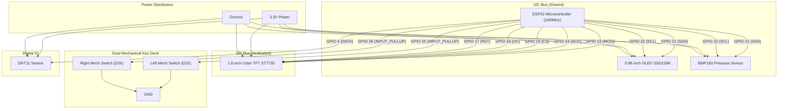

# ⚡ chaos-desky — ESP32 Dual-Display Desktop & Command Hub

**chaos-desky** is an advanced standalone ESP32 dual-display desktop companion and tactical workstation hub. It combines a vibrant 1.8" ST7735 color TFT screen, an ultra-crisp 0.96" SSD1306 OLED display, dual mechanical keyboard switches with dynamic macro customization, environmental sensors (DHT11 & BMP180), BLE telemetry & notifications, multi-brand watch faces, animated screensavers, and an embedded LittleFS interactive web dashboard.

---

## 🛠️ Key Features & Capabilities

- 🖥️ **Dual Display Command Center**:
  - **1.8" SPI Color TFT LCD (ST7735, 128x160)**: 10-page custom carousel display (default 180° rotation) featuring smooth laser-wipe page transitions:
    1. Outdoor Weather & OpenWeatherMap Forecast (Custom City & Country).
    2. Barometric Pressure Graph & Zambretti Forecast Engine.
    3. Pomodoro Work/Break Timer & Action Hub.
    4. Free Heap RAM Status, WiFi Details & Interactive Web QR Code Dashboard.
    5. To-Do List & Daily Focus Dashboard with Live Checkoff Controls.
    6. Indoor Climate Sensor Telemetry (Temperature, Humidity, Dew Point, Heat Index, Altitude).
    7. BLE Notification Center & Message Logs.
    8. Custom Watch Face Studio (10 Iconic Watch Faces: Swiss, Cyber, Modern Digital, Nixie, Casio F-91W, Casio G-Shock, Casio CA-53W Calculator, Casio Royale, Seiko Diver, Pulsar LED).
    9. Network Scan Monitor & Signal RSSI Analysis.
    10. 3D Warp Space Screensaver.
  - **0.96" I2C Monochrome OLED (SSD1306, 128x64)**: 7 distinct operational modes:
    1. **Telemetry HUD**: Live clock, IP address, Temperature & WiFi RSSI.
    2. **8 Iconic OLED Clock Faces**: Digital HUD, Analog Minimalist, Cyber Matrix, Retro Airport Flip, Oversized Vertical Stack, Binary Segment Gauges, Cyberpunk Boxed Frame, and Radial Horizon Arc Clock!
    3. **Sparkline Telemetry**: Historical Barometric pressure and indoor climate trend lines.
    4. **Fast-Speed Marquee Ticker**: High-speed, fluid 45ms scrolling custom announcements.
    5. **Retro Cyber Radar**: Futuristic rotating sweeping radar vector graphic.
    6. **Cute Cyber Cat Mascot**: Animated blinking feline desk pet screensaver.
    7. **Dedicated WiFi AP Credentials**: Broadcasts current network status, IP, SSID, and password!

- 🕹️ **Resistorless Dual Mechanical Switches & Macro Studio**:
  - Direct connection to internal ESP32 pullups on **GPIO 25 (Left Key)** and **GPIO 26 (Right Key)** to GND.
  - **Dynamic Macro Deck**: Configure Custom Single Clicks, Double Clicks, and Long Holds directly from the Web Dashboard and store in persistent LittleFS!
  - **Default Mapping**: Left Single Click switches TFT pages, Right Single Click cycles OLED clock modes, Left Double Click opens the To-Do Board, and Right Double Click enters Watchface Studio.
  - **🤝 Simultaneous Dual-Button Combo**: Press and hold both switches simultaneously to fire instant global macros (e.g., instant WiFi Credentials Broadcast across both screens or stealth dual screensaver launch!).
  - **⚡ Smart Context-Aware Controls**: When viewing interactive screens (such as the To-Do Board or Pomodoro Timer), single clicks automatically transform from carousel switching into instinctive item controllers (moving task focus down, checking/unchecking items, or toggling/resetting timers!).

- 📡 **BLE Smartwatch Sync, Telemetry & Command Hub**:
  - Open Nordic UART BLE receiver allowing lossless telemetry broadcast from PC gaming monitors or mobile terminals without OS encryption pairing errors.
  - **Configurable Alert Display Target**: Customize directly in the Web Portal whether system alerts, BLE popups, timer notifications, and telemetry appear on the OLED display, the TFT screen, or simultaneously across both!
  - Send wireless terminal commands (`casio`, `gshock`, `page <0..9>`, or `pc:CPU=52C, GPU=61C`).

- 🌐 **Embedded Tabbed Web Dashboard**:
  - Full mobile-responsive UI hosted on LittleFS featuring interactive cards: Telemetry, Watch Face Customizer, Mechanical Macro & Button Studio, BLE Hub, Marquee Publisher, and Resource Optimization Hub.
  - Real-time sliders for OLED contrast/brightness, 11 TFT color themes, screen rotation, carousel page masking, system notification screen target, and feature toggling.

- 🎨 **11 Tailored Color Themes**:
  - Cyberpunk, Matrix, Dark Glass, Retro, Dracula, Nord, Gruvbox, Monochrome, Nothing UI, One UI, and Material You.

---

## 🔌 Hardware Wiring

| Component | Interface | ESP32 GPIO Pins | Notes |
| :--- | :--- | :--- | :--- |
| **OLED Display (SSD1306)** | I2C | SDA: `GPIO 21`, SCL: `GPIO 22` | Shared I2C Bus, 3.3V Power |
| **BMP180 Sensor** | I2C | SDA: `GPIO 21`, SCL: `GPIO 22` | Shared I2C Bus, 3.3V Power |
| **DHT11 Sensor** | Digital | Data: `GPIO 4` | Direct sensor data line |
| **TFT Display (ST7735)** | SPI | CS: `GPIO 15`, DC: `GPIO 16`, RST: `GPIO 17`, MOSI: `GPIO 13`, SCK: `GPIO 14` | Dedicated Hardware SPI Bus |
| **Left Mechanical Switch** | Digital (Pull-Up) | `GPIO 25` ➔ GND | No external resistors needed |
| **Right Mechanical Switch** | Digital (Pull-Up) | `GPIO 26` ➔ GND | No external resistors needed |

---

## ⚡ Circuit Diagram



---

## 🚀 Building, Flashing & Running

1. Build & flash firmware to ESP32:
   ```bash
   pio run -t upload
   ```
2. Upload embedded LittleFS Web Dashboard files (`data/` folder):
   ```bash
   pio run -t uploadfs
   ```
3. Connect your device or smartphone to the WiFi network and navigate to the dashboard:
   `http://<ESP32_IP>` (e.g. `http://192.168.1.6`). You can also hold both mechanical buttons together to immediately broadcast your IP address and QR code across both display screens!
