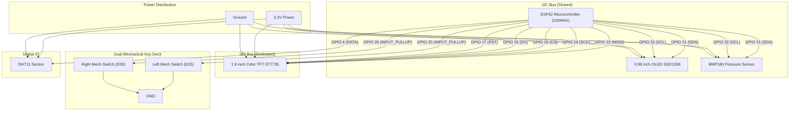

# ⚡ chaos-desky — ESP32 Dual-Display Desktop & Command Hub

**chaos-desky** is an advanced standalone ESP32 dual-display desktop companion and tactical workstation hub. It combines a vibrant 1.8" ST7735 color TFT screen, an ultra-crisp 0.96" SSD1306 OLED display, dual mechanical keyboard switches with dynamic macro customization, environmental sensors (DHT11 & BMP180), BLE telemetry & notifications, multi-brand watch faces, animated screensavers, and an embedded LittleFS interactive web dashboard.

---

## 🛠️ Key Features & Capabilities

- 🖥️ **Dual Display Command Center**:
  - **1.8" SPI Color TFT LCD (ST7735, 128x160)**: 13-page custom carousel display (default 180° rotation) featuring smooth laser-wipe page transitions:
    1. **Outdoor Weather**: Live temperature, weather icon, condition description, wind speed & humidity from OpenWeatherMap.
    2. **Barometric Pressure Trend & Zambretti Weather Forecaster**: Sparkline graph of air pressure history & local prediction.
    3. **Pomodoro Productivity Work/Break Timer**: Interactive timer with pause/resume state retention and visual countdown ring.
    4. **System QR Code Dashboard**: Instant scanning QR code to access the embedded ESP32 web control portal, WiFi IP & Heap memory status.
    5. **To-Do List & Daily Focus Board**: Interactive checklist with live checkoff controls and focus selector.
    6. **Indoor Climate Telemetry**: Precision readings (Temperature, Dew Point, Heat Index, Humidity, Altitude) featuring **7 distinct UI themes**.
    7. **Watch Face Studio**: 15 Iconic Watch Faces including analog designs and digital classics.
    8. **Network Monitor**: Live WiFi signal analysis, RSSI indicator, MAC address & gateway stats.
    9. **System Hardware & Telemetry Diagnostics**: Deep dive into Free Heap RAM, Flash storage utilization, uptime, and CPU status.
    10. **OLED Studio Hub**: Dedicated TFT controller to manage OLED modes and clock faces.
    11. **Temperature History Graph**: Dynamic historical line chart tracking temperature trends over time.
    12. **Humidity History Graph**: Dynamic historical line chart tracking ambient humidity.
    13. **Comfort Index**: Visual indication of overall air quality and comfort levels.
  - **0.96" I2C Monochrome OLED (SSD1306, 128x64)**: 6 distinct operational modes:
    0. **Telemetry HUD**: Live clock, IP address, Temperature & WiFi RSSI.
    1. **Multi-Style OLED Clock Faces**: Digital HUD, Analog Minimalist, Cyber Matrix, Retro Airport Flip, Vertical Stack, Binary Gauges, Cyberpunk Frame, and Radial Horizon Arc!
    2. **Sparkline Telemetry**: Historical Barometric pressure and indoor climate trend lines.
    3. **Fast-Speed Marquee Ticker**: High-speed, fluid 45ms scrolling custom announcements and desk notes.
    4. **Animated Screensaver**: Rotating animations including Matrix Code Rain, Bouncing DVD Logo, 3D Hyperspace Tunnel, DNA Helix, Batman Signal, and Linux Tux!
    5. **Dedicated WiFi AP Credentials**: Broadcasts current network status, IP, SSID, and connection instructions.

- 🕹️ **Intuitive Dual Mechanical Switch Deck (Left = Nav | Right = Functionality)**:
  - Direct connection to internal ESP32 pullups on **GPIO 25 (Left Key)** and **GPIO 26 (Right Key)** to GND. No external resistors required!
  - **⬅️ Left Button (Navigation Master)**:
    - **Single Click (Instant Trigger)**: Instantly cycles forward through the 13 TFT pages without any double-click debounce delay.
    - **Long Press**: Instant home jump back to Page 0 (Outdoor Weather).
  - **➡️ Right Button (Page-Specific Functional Action Engine)**:
    - **Page 0 (Weather)**: Single click forces an instant cloud refresh of OpenWeatherMap data.
    - **Page 1 (Barometer)**: Single click logs an instantaneous barometric pressure sample to the trend graph.
    - **Page 2 (Pomodoro)**: Single click Toggles Start/Pause; Double click Resets the timer back to 25:00.
    - **Page 3 (System QR)**: Single click cycles the secondary OLED Display mode.
    - **Page 4 (To-Do Board)**: Single click Checks/Unchecks the selected task; Double click moves focus down to the next item!
    - **Page 5 (Climate)**: Single click triggers cycles through the 7 distinct climate dashboard UI themes.
    - **Page 6 (Watchface Studio)**: Single click cycles between the 15 iconic watch styles; Double click jumps straight to the Casio F-91W!
    - **Page 7 (Network Monitor)**: Single click broadcasts full WiFi credentials across both screens.
    - **Page 8 (Hardware Stats)**: Single click cycles between the 11 TFT Color Themes!
    - **Page 9 (OLED Studio Hub)**: Single click cycles OLED display modes. Double click cycles OLED clock face styles.
    - **Long Press (Global Fallback)**: Immediately unleashes the synchronized animated dual screensaver!
  - **🤝 Simultaneous Dual-Button Combo**: Press and hold both switches together to trigger global shortcut macros (configurable in web portal).

- 📡 **BLE Wi-Fi Provisioning & Telemetry**:
  - Open Nordic UART BLE receiver (`chaos-desky-wifi`) allowing seamless Wi-Fi setup and terminal diagnostic status inspection without OS encryption pairing errors.
  - **Configurable Alert Display Target**: Customize directly in the Web Portal whether system alerts, WiFi status, and timer notifications appear on the OLED display, the TFT screen, or simultaneously across both!

- 🌐 **Embedded LittleFS Web Command Portal**:
  - Premium glassmorphic mobile-responsive UI hosted on LittleFS featuring interactive cards: Sensor Telemetry, Watch Face Customizer, Pomodoro & To-Do Task Manager, BLE Wi-Fi Setup Hub, Custom Marquee Publisher, and Resource Optimization Hub.
  - Real-time sliders for OLED contrast/brightness, 11 TFT color themes, screen rotation, carousel page masking, system notification screen target, and feature toggling.

- ⚡ **Flash & Memory Optimized Architecture**:
  - Surgically pruned redundant mobile notification overhead and unused macro structs to preserve precious ESP32 application partition storage (98% utilization, zero flash overflows) while keeping the visual WOW factor running at full frame rate!

- 🎨 **11 Tailored Color Themes**:
  - Cyberpunk, Matrix, Dark Glass, Retro, Dracula, Nord, Gruvbox, Monochrome, Nothing UI, One UI, and Material You.

---

## 🔌 Hardware Wiring

| Component | Interface | ESP32 GPIO Pins | Notes |
| :--- | :--- | :--- | :--- |
| **OLED Display (SSD1306)** | I2C | SDA: `GPIO 21`, SCL: `GPIO 22` | Shared I2C Bus, 3.3V Power |
| **BMP180 Sensor** | I2C | SDA: `GPIO 21`, SCL: `GPIO 22` | Shared I2C Bus, 3.3V Power |
| **DHT11 Sensor** | Digital | Data: `GPIO 4` | Direct sensor data line |
| **TFT Display (ST7735)** | SPI | CS: `GPIO 15`, DC: `GPIO 16`, RST: `GPIO 17`, MOSI: `GPIO 13`, SCK: `GPIO 14` | Dedicated Hardware SPI Bus |
| **Left Mechanical Switch** | Digital (Pull-Up) | `GPIO 25` ➔ GND | No external resistors needed |
| **Right Mechanical Switch** | Digital (Pull-Up) | `GPIO 26` ➔ GND | No external resistors needed |

---

## ⚡ Circuit Diagram



---

## 🚀 Building, Flashing & Running

1. Build & flash firmware to ESP32:
   ```bash
   pio run -t upload
   ```
2. Upload embedded LittleFS Web Dashboard files (`data/` folder):
   ```bash
   pio run -t uploadfs
   ```
3. Connect your device or smartphone to the WiFi network and navigate to the dashboard:
   `http://<ESP32_IP>` (e.g. `http://192.168.1.6`). You can also hold both mechanical buttons together to immediately broadcast your IP address and QR code across both display screens!
