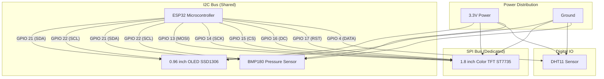

# ⚡ chaos-desky — ESP32 Dual-Display Desktop Hub

**chaos-desky** is a standalone ESP32 dual-display desktop companion device. It combines an ST7735 color TFT screen, an SSD1306 OLED display, environmental sensors (DHT11 and BMP180), BLE iPhone notification popups, watch faces, animated screensavers, and an embedded LittleFS web control dashboard.

---

## 🛠️ Features Overview

- 🖥️ **Dual Display Setup**:
  - **1.8" SPI Color TFT LCD (ST7735, 128x160)**: 10-page carousel display (default 180° rotation) with laser wipe page transitions:
    1. Outdoor Weather & OpenWeatherMap Forecast (Configurable Location).
    2. Barometric Pressure Graph & Zambretti Forecast.
    3. Pomodoro Timer & Clock.
    4. Free Heap RAM Status & Web QR Code.
    5. To-Do List & Daily Focus Dashboard.
    6. Indoor Climate Sensor Telemetry.
    7. Notification Center.
    8. Custom Watch Face Studio (10 Iconic Watch Faces: Swiss, Cyber, Modern Digital, Nixie, Casio F-91W, Casio G-Shock, Casio CA-53W Calculator, Casio Royale, Seiko Diver, Pulsar LED).
    9. Network Monitor.
    10. 3D Warp Space Screensaver.
  - **0.96" I2C Monochrome OLED (SSD1306, 128x64)**: 6 display modes (Telemetry HUD, Digital Clock, Temp/Humidity Sparklines, Custom Text Marquee Ticker, Retro Cyber Radar, Cyber Cat Mascot).

- 📱 **BLE Smartwatch Sync & Notifications**:
  - ESP32 advertises over Bluetooth for incoming notifications and popup banners.

- 🌐 **Embedded Tabbed Web Dashboard**:
  - Embedded web interface hosted on LittleFS with 5 tabs (Telemetry, Watch Faces, Smartwatch, Marquee Ticker, Settings, Optimization Hub).
  - Instant marquee ticker publisher to broadcast messages across the OLED screen.
  - Web controls for Pomodoro timers, 11 color themes, screen rotation, carousel page selection, feature toggles, and test notifications.

- 🎨 **11 Color Themes**:
  - Cyberpunk, Matrix, Dark Glass, Retro, Dracula, Nord, Gruvbox, Monochrome, Nothing UI, One UI, Material You.

---

## 🔌 Hardware Wiring

| Component | Interface | ESP32 GPIO Pins |
| :--- | :--- | :--- |
| **OLED Display (SSD1306)** | I2C | SDA: `GPIO 21`, SCL: `GPIO 22` |
| **BMP180 Sensor** | I2C | SDA: `GPIO 21`, SCL: `GPIO 22` |
| **DHT11 Sensor** | Digital | Data: `GPIO 4` |
| **TFT Display (ST7735)** | SPI | CS: `GPIO 15`, DC: `GPIO 16`, RST: `GPIO 17`, MOSI: `GPIO 13`, SCK: `GPIO 14` |

---

## ⚡ Circuit Diagram



---

## 🚀 Building & Flashing

1. Build firmware:
   ```bash
   pio run -t upload
   ```
2. Upload LittleFS Web Dashboard:
   ```bash
   pio run -t uploadfs
   ```
3. Open web dashboard in browser:
   `http://<ESP32_IP>` (e.g. `http://192.168.1.6`).
