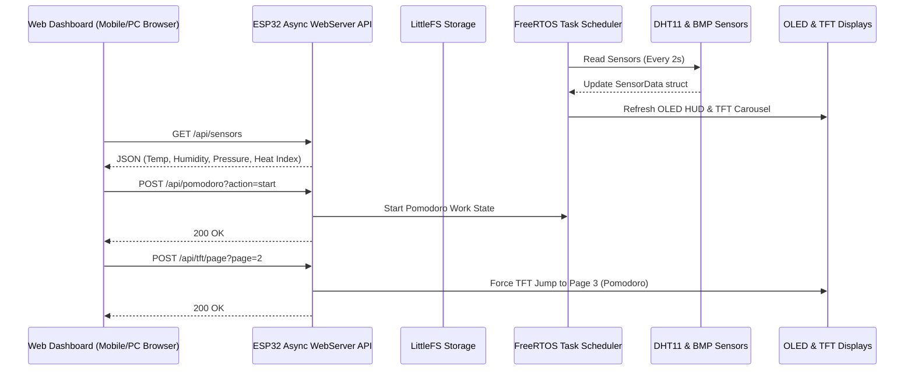

# ⚡ chaos-desky — ESP32 Smart Dual-Display Desk Companion

Welcome to **chaos-desky**, an advanced, feature-rich standalone ESP32 dual-display desktop companion. This project combines dual hardware displays (Color TFT + Monochrome OLED) with an embedded responsive web dashboard to deliver a personal environmental & productivity hub right to your desk.

---

## ✨ Key Features

- 📶 **Auto-Provisioning & On-Display QR Code**:
  - Connects to your local Wi-Fi or defaults to an Access Point hotspot (`ChaosDesky-AP`).
  - Generates crisp, real-time native **QR Codes** rendered on the TFT display pointing directly to `http://<ESP32_IP>` for instant mobile pairing.

- 🖥️ **Dual Hardware Displays**:
  - **128x160 SPI Color TFT LCD (ST7735)**: Features a **4-Page Dynamic Auto-Carousel** (10-second auto-transition or manual remote control):
    - **Page 1: Outdoor Internet Weather & Forecast** (OpenWeatherMap API integration with live condition icons, temp, humidity, and min/max).
    - **Page 2: Barometric Pressure Sparkline & Zambretti Storm Forecaster** (24-sample pressure graph with color-coded trends + Zambretti storm prediction algorithm: *"Settled Fine"*, *"Showers Likely"*, *"Storm Warning"* + Comfort index gauge).
    - **Page 3: Cyberpunk Pomodoro Focus Hub & Digital Clock** (NTP-synced clock + 25m Work / 5m Rest Pomodoro timer with visual progress bar).
    - **Page 4: Hardware Telemetry & Web QR Code** (RAM heap usage, CPU frequency, uptime, and dynamic mobile pairing QR code).
  - **128x64 I2C Monochrome OLED (SSD1306)**: Dedicated real-time local sensor telemetry HUD displaying DHT11 (Temperature & Humidity), BMP180/BMP280 (Barometric Pressure & Altitude), calculated Heat Index, Dew Point, WiFi RSSI signal strength meter, and NTP clock.

- 🌐 **Embedded Glassmorphism Web Dashboard**:
  - Responsive dark-mode web portal hosted directly on the ESP32 via LittleFS.
  - Remote control for Pomodoro focus timer (Start, Pause, Reset, Rest).
  - Remote TFT page switcher and instant color theme engine.
  - Live indoor & outdoor metric monitoring.

- 🎨 **4-Theme Synchronization Engine**:
  - Swap themes via the web dashboard or API to instantly change TFT color palettes:
    - 🌌 **Cyberpunk Synthwave**: Neon cyan, magenta, and amber on dark navy.
    - 📟 **Matrix Hacker**: Classic green-on-black terminal aesthetics.
    - 🧊 **Dark Glass**: Charcoal dark slate gray with pastel blue and orange indicators.
    - 👾 **Retro Arcade**: High-contrast primary yellow, red, green, and cyan palette.

---

## 🛠️ Hardware Requirements

| Component | Description | Protocol / Pins |
| :--- | :--- | :--- |
| **Microcontroller** | ESP32 Dev Module (WROOM-32 / ESP32-D0WD) | 240MHz, 320KB RAM |
| **Primary Display** | 1.8" SPI Color TFT LCD (ST7735, 128x160) | SPI (`CS: 15, DC: 16, RST: 17, MOSI: 13, SCK: 14`) |
| **Secondary Display** | 0.96" I2C Monochrome OLED (SSD1306, 128x64) | I2C (`SDA: 21, SCL: 22`) |
| **Climate Sensor** | DHT11 (Digital Temp & Humidity) | Digital IO (`GPIO 4`) |
| **Pressure Sensor** | BMP180 or BMP280 (Barometric Pressure & Altitude) | I2C (`SDA: 21, SCL: 22`) |

---

## 🔌 Circuit Diagram

```mermaid
graph TD
    ESP32[ESP32 Microcontroller]

    subgraph I2C Bus (Shared)
        ESP32 -- "GPIO 21 (SDA)" --> OLED[0.96" OLED SSD1306]
        ESP32 -- "GPIO 22 (SCL)" --> OLED
        ESP32 -- "GPIO 21 (SDA)" --> BMP[BMP180/280 Sensor]
        ESP32 -- "GPIO 22 (SCL)" --> BMP
    end

    subgraph SPI Bus (Dedicated)
        ESP32 -- "GPIO 13 (MOSI)" --> TFT[1.8" Color TFT ST7735]
        ESP32 -- "GPIO 14 (SCK)"  --> TFT
        ESP32 -- "GPIO 15 (CS)"   --> TFT
        ESP32 -- "GPIO 16 (DC)"   --> TFT
        ESP32 -- "GPIO 17 (RST)"  --> TFT
    end

    subgraph Digital IO
        ESP32 -- "GPIO 4 (DATA)"  --> DHT[DHT11 Sensor]
    end

    subgraph Power Distribution
        3V3[3.3V Power] --> OLED
        3V3 --> TFT
        3V3 --> DHT
        3V3 --> BMP
        GND[Ground]     --> OLED
        GND --> TFT
        GND --> DHT
        GND --> BMP
    end
```

*See [README_PIN_DIAGRAM.md](README_PIN_DIAGRAM.md) for detailed pin mappings and wiring advice.*

---

## 🏗️ System Architecture & Data Flow



*See [README_ARCHITECTURE.md](README_ARCHITECTURE.md) for a deep dive into task scheduling, memory footprint, and the Zambretti forecasting algorithm.*

---

## 🌐 REST API Endpoints

The embedded web server exposes clean REST endpoints:

| Endpoint | Method | Description |
| :--- | :---: | :--- |
| `/api/sensors` | `GET` | Returns indoor sensor telemetry (DHT + BMP metrics, heat index, min/max). |
| `/api/weather` | `GET` | Returns outdoor OpenWeatherMap API metrics (temp, condition, min/max). |
| `/api/pomodoro` | `GET` | Returns active Pomodoro timer state, remaining time, and completed session count. |
| `/api/pomodoro` | `POST` | Controls timer (`?action=start\|pause\|resume\|reset\|break`). |
| `/api/tft/page` | `POST` | Sets active TFT carousel page (`?page=0\|1\|2\|3`). |
| `/api/tft/theme` | `POST` | Sets active TFT color theme (`?theme=0\|1\|2\|3`). |

---

## 🚀 Quick Setup & Installation

### 1. Configure Settings
Edit `include/config.h` to set your Wi-Fi credentials and OpenWeatherMap API details:
```cpp
#define DEFAULT_WIFI_SSID "Your_WiFi_SSID"
#define DEFAULT_WIFI_PASS "Your_WiFi_Password"
#define OPENWEATHER_API_KEY "Your_OpenWeather_API_Key"
#define OPENWEATHER_CITY "Your_City"
```

### 2. Build & Flash via PlatformIO
```bash
# Upload Firmware
pio run -d /home/chaos/coding/esp32/new-idea/chaos-desky -t upload

# Upload Web Filesystem (LittleFS)
pio run -d /home/chaos/coding/esp32/new-idea/chaos-desky -t uploadfs
```

---

## 📄 Documentation Index
- [README_PIN_DIAGRAM.md](README_PIN_DIAGRAM.md) — Pinouts, wiring diagrams, and power advice.
- [README_ARCHITECTURE.md](README_ARCHITECTURE.md) — FreeRTOS task scheduling, memory usage, and algorithm math.
- [CHANGELOG.md](CHANGELOG.md) — Release notes and version history.
