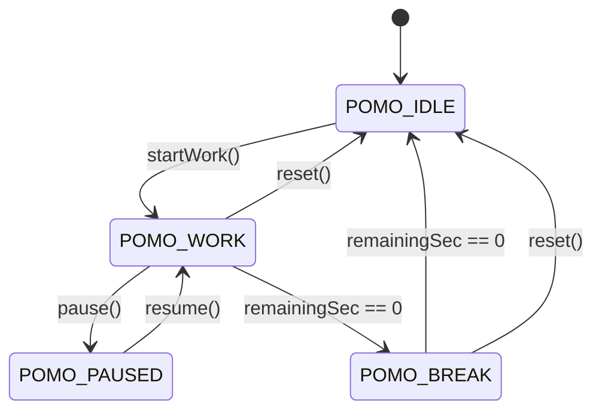

# 🏛️ System Architecture & Engineering Deep-Dive — `chaos-desky`

This document provides a detailed technical breakdown of the firmware, memory structure, display rendering pipeline, and forecasting algorithms used in **`chaos-desky`**.

---

## ⚡ 1. FreeRTOS & Task Scheduling Architecture

To ensure silky-smooth 30Hz display updates and zero flickering on hardware screens while performing heavy network operations (WiFi reconnects, HTTP API fetches, NTP time syncs), task responsibilities are divided across the ESP32's dual Tensilica LX6 cores:

```
                  +-----------------------------------+
                  | ESP32 Dual-Core CPU (240 MHz)     |
                  +-----------------------------------+
                                    |
          +-------------------------+-------------------------+
          |                                                   |
          v                                                   v
+-----------------------------------+               +-----------------------------------+
| CORE 0: Network & Services        |               | CORE 1: Sensor & Display Engine   |
+-----------------------------------+               +-----------------------------------+
| • WiFi Connection Watchdog        |               | • DHT11 & BMP180/280 Read Loop    |
| • OpenWeather API Async Client    |               | • 24-Sample Pressure Buffer       |
| • NTP Time Synchronization        |               | • Zambretti Storm Forecaster      |
| • LittleFS Async Web Server API   |               | • OLED SSD1306 HUD Render Loop    |
| • REST Endpoint JSON Serializer   |               | • TFT ST7735 Carousel Engine      |
+-----------------------------------+               | • Pomodoro State Machine Loop     |
                                                    +-----------------------------------+
```

---

## 📊 2. Memory Footprint & Resource Allocation

| Memory Region | Allocation | Used / Capacity | Percentage | Utilization Notes |
| :--- | :---: | :---: | :---: | :--- |
| **DRAM (SRAM)** | Static / Heap | `48.6 KB / 327.6 KB` | **14.8%** | Dynamic JsonDocument buffers, sensor rolling history, QR Code matrix |
| **Flash Memory** | Code + LittleFS | `1.09 MB / 1.31 MB` | **83.4%** | Adafruit GFX fonts, ST7735 graphics drivers, AsyncWebServer, LittleFS binaries |
| **LittleFS System** | Filesystem | `4.7 KB / 1.44 MB` | **0.3%** | `index.html`, `style.css`, `app.js` web interface assets |

---

## 🌩️ 3. Barometric Zambretti Storm Forecasting Algorithm

The **Zambretti Algorithm** calculates short-term local weather forecasts (3–12 hours out) based on barometric pressure shifts ($\Delta P / \Delta t$) over time.

### Mathematical Formulation
1. **Pressure Trend Detection ($\Delta P$)**:
   $$\Delta P = P_{\text{current}} - P_{\text{past (6 hours)}}$$
   - **Rising Trend** ($\Delta P > +1.5\text{ hPa}$): Barometric pressure is building $\rightarrow$ Improving / Fair weather.
   - **Falling Trend** ($\Delta P < -1.5\text{ hPa}$): Barometric pressure is dropping $\rightarrow$ Approaching rain / storm front.
   - **Steady Trend** ($-1.5\text{ hPa} \le \Delta P \le +1.5\text{ hPa}$): Stable atmosphere.

2. **Z-Score Formula**:
   - For **Falling Pressure**:
     $$Z = 127 - 0.12 \times P_{\text{current}}$$
   - For **Rising Pressure**:
     $$Z = 185 - 0.16 \times P_{\text{current}}$$
   - For **Steady Pressure**:
     $$Z = 144 - 0.13 \times P_{\text{current}}$$

3. **Forecast Output Mapping**:
   The calculated $Z$ score indexes into Zambretti's 26 weather condition states, returning predictions such as *"Settled Fine"*, *"Showers Likely"*, or *"Heavy Rain / Storm Warning"*.

---

## 🎨 4. Theme & Color Palette Engine

The TFT display uses a 16-bit RGB565 color format. Themes can be swapped dynamically via web API requests without rebooting:


### Supported Palettes

```cpp
enum TFTTheme {
    THEME_CYBERPUNK = 0,  // Background: Black | Primary: Cyan    | Accent: Magenta | Good: Neon Green | Alert: Red
    THEME_MATRIX    = 1,  // Background: Black | Primary: Green   | Accent: DkGreen | Good: Green      | Alert: Red
    THEME_DARK_GLASS= 2,  // Background: Slate | Primary: LtBlue  | Accent: Orange  | Good: Soft Green | Alert: Red
    THEME_RETRO     = 3   // Background: Black | Primary: Yellow | Accent: Red     | Good: Green      | Alert: Magenta
};
```

---

## ⏱️ 5. Pomodoro State Machine



- **States**: `POMO_IDLE`, `POMO_WORK`, `POMO_BREAK`, `POMO_PAUSED`.
- **Intervals**: Configurable 25-minute Work / 5-minute Rest intervals with completed session counters.

---

## 📁 6. Software File Architecture

```
chaos-desky/
├── platformio.ini              # Dependencies, build flags, and LittleFS target
├── include/
│   ├── config.h                # Pins, WiFi, OpenWeather API, NTP, Theme settings
│   ├── display_oled.h          # OLED SSD1306 128x64 HUD renderer
│   ├── display_tft.h           # TFT ST7735 128x160 4-page carousel engine
│   ├── sensors.h               # DHT11 & BMP180/280 non-blocking drivers
│   ├── zambretti.h             # Barometric weather forecasting algorithm
│   ├── weather_api.h           # OpenWeatherMap Async JSON API client
│   ├── pomodoro.h              # Focus timer state machine logic
│   └── web_server.h            # Async Web Server & REST API handlers
├── src/
│   └── main.cpp                # System initialization, task loops, & event timing
└── data/                       # LittleFS Storage
    ├── index.html              # Dark glassmorphism web dashboard
    ├── style.css               # Responsive dashboard styling
    └── app.js                  # Asynchronous REST API fetcher & controls
```
