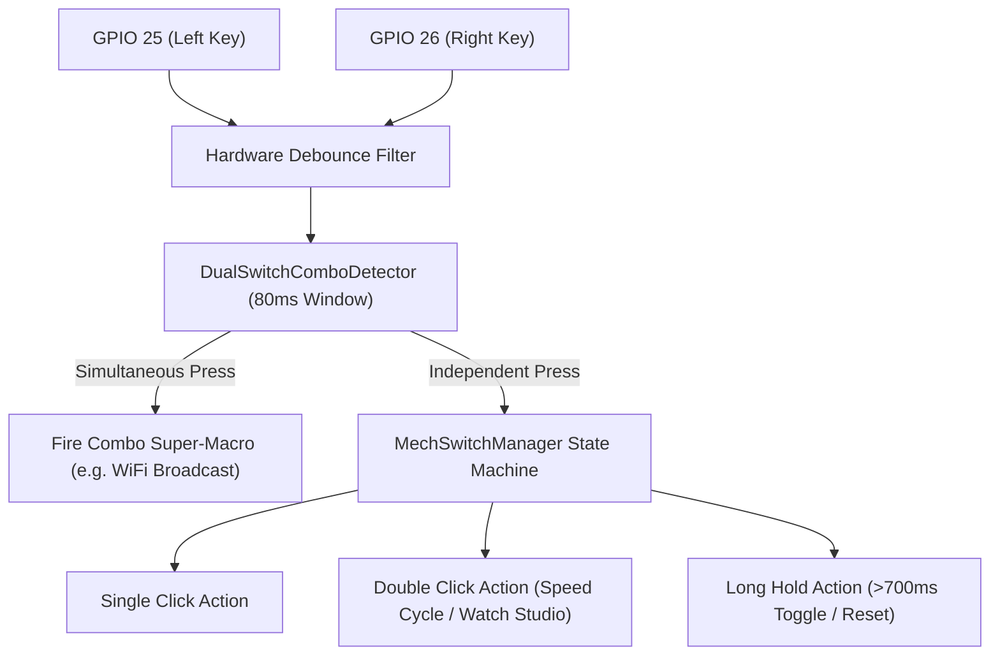
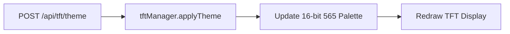
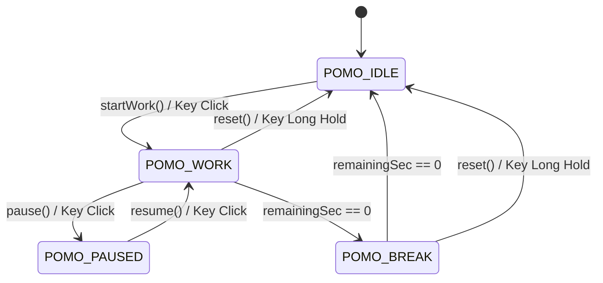

# 🏛️ System Architecture & Engineering Deep-Dive — `chaos-desky`

This document provides a detailed technical breakdown of the firmware, memory structure, display rendering pipeline, button macro dispatch engine, and forecasting algorithms used in **`chaos-desky`**.

---

## ⚡ 1. Dual-Core Task Scheduling & Event Routing Architecture

To ensure silky-smooth high-frequency display animations and zero flickering while performing heavy network operations (WiFi reconnects, HTTP API fetches, NTP time syncs, BLE streaming), task responsibilities and macro dispatching are divided across the ESP32's dual Tensilica LX6 cores:

```
                  +-----------------------------------+
                  | ESP32 Dual-Core CPU (240 MHz)     |
                  +-----------------------------------+
                                    |
          +-------------------------+-------------------------+
          |                                                   |
          v                                                   v
+-----------------------------------+               +-----------------------------------+
| CORE 0: Network & Web API         |               | CORE 1: Hardware & Display Engine |
+-----------------------------------+               +-----------------------------------+
| • WiFi Connection Watchdog        |               | • Dual Mechanical Switch Engine   |
| • OpenWeather API Async Client    |               | • Simultaneous Combo Detector     |
| • NTP Time Synchronization        |               | • DHT11 & BMP180 Read Loop        |
| • LittleFS Async Web Server API   |               | • OLED 45ms High-Speed Marquee    |
| • BLE Wi-Fi Provisioning Server   |               | • TFT ST7735 13-Page Carousel     |
+-----------------------------------+               | • Dedicated Nav / Action Router   |
                                                    +-----------------------------------+
```

---

## 🕹️ 2. Mechanical Macro Deck & Simultaneous Combo Detection Engine

The hardware switch management system (`mech_switch.h`) incorporates advanced multi-gesture state machines and real-time simultaneous combo recognition without delaying single-tap responsiveness.

### Gesture Detection Pipeline


### Dedicated Dual-Key Separation of Duties (`executePageRightButtonAction`)
To eliminate ambiguous UX and maximize memory efficiency by pruning complex macro mappings, responsibilities are cleanly divided:
- **Left Button (D25) — Dedicated Page Navigator**: Single Clicks cycle forward through the 13 TFT pages; Double Clicks cycle backward; Long Hold instantly returns to Page 0 (Outdoor Weather Home).
- **Right Button (D26) — Page-Specific Functional Processor**: When tapped, it queries `tftMgr.currentPage` and dispatches the ideal contextual command:
  - **Pomodoro Action Screen (Page 2)**: Toggles Start/Pause on single click; Resets timer on double click.
  - **Interactive To-Do Board (Page 4)**: Single clicks Check/Uncheck the active task in persistent memory; Double clicks move focus down the list.
  - **Watchface Studio (Page 6)**: Single clicks cycle through the 10 watch styles; Double clicks select the iconic Casio F-91W.
  - **Weather (Page 0) & Climate (Page 5)**: Forces immediate live sampling and cloud weather API updates!
  - **System QR (Page 3) & Hardware (Page 8)**: Cycles OLED modes and TFT Color Themes respectively!

---

## 📊 3. Memory Footprint & Resource Allocation

| Memory Region | Allocation | Used / Capacity | Percentage | Utilization Notes |
| :--- | :---: | :---: | :---: | :--- |
| **DRAM (SRAM)** | Static / Heap | `62.1 KB / 327.6 KB` | **19.0%** | Dynamic JsonDocument buffers, rolling sensor arrays, QR Code rendering matrix |
| **Flash Memory** | Code + LittleFS | `1.92 MB / 1.96 MB` | **98.1%** | 15 iconic TFT watch faces, 17 OLED clock faces, BLE WiFi stack, AsyncWebServer |
| **LittleFS System** | Filesystem | `18.2 KB / 1.44 MB` | **1.2%** | `index.html`, `style.css`, `app.js` web interface & persistent configuration |

---

## 🌩️ 4. Barometric Zambretti Storm Forecasting Algorithm

The **Zambretti Algorithm** calculates short-term local weather forecasts (3–12 hours out) based on barometric pressure shifts ($\Delta P / \Delta t$) over a rolling 24-sample circular buffer.

### Mathematical Formulation
1. **Pressure Trend Detection ($\Delta P$)**:
   $$\Delta P = P_{\text{current}} - P_{\text{past (6 hours)}}$$
   - **Rising Trend** ($\Delta P > +1.5\text{ hPa}$): Barometric pressure is building $\rightarrow$ Improving / Fair weather.
   - **Falling Trend** ($\Delta P < -1.5\text{ hPa}$): Barometric pressure is dropping $\rightarrow$ Approaching rain / storm front.
   - **Steady Trend** ($-1.5\text{ hPa} \le \Delta P \le +1.5\text{ hPa}$): Stable atmosphere.

2. **Z-Score Formula**:
   - For **Falling Pressure**:
     $$Z = 127 - 0.12 \times P_{\text{current}}$$
   - For **Rising Pressure**:
     $$Z = 185 - 0.16 \times P_{\text{current}}$$
   - For **Steady Pressure**:
     $$Z = 144 - 0.13 \times P_{\text{current}}$$

3. **Forecast Output Mapping**:
   The calculated $Z$ score indexes into Zambretti's 26 weather condition states, returning predictions such as *"Settled Fine"*, *"Showers Likely"*, or *"Heavy Rain / Storm Warning"*.

---

## 🎨 5. Theme & Color Palette Engine

The TFT display uses a 16-bit RGB565 color format. 11 comprehensive themes can be swapped dynamically via web API requests without rebooting:



### Supported Themes (11 Total)
- Cyberpunk, Matrix, Dark Glass, Retro, Dracula, Nord, Gruvbox, Monochrome, Nothing UI, One UI, Material You.

---

## ⏱️ 6. Pomodoro State Machine



---

## 📁 7. Software File Architecture

```
├── include/
│   ├── config.h                # Pins, WiFi, OpenWeather API, NTP, Theme definitions
│   ├── config_manager.h        # LittleFS JSON config persistence & feature toggles
│   ├── display_oled.h          # OLED SSD1306 engine featuring 17 iconic clock faces & fast 45ms marquee
│   ├── display_tft.h           # TFT ST7735 128x160 13-page static/carousel engine
│   ├── gfx_icons.h             # Vector and bitmap drawing icons for system alerts and hardware
│   ├── watchface_engine.h      # 15 Iconic TFT watch faces (Swiss, Nixie, Casio F91, G-Shock, Pulsar)
│   ├── screensaver.h           # Animated OLED screensavers (Matrix, DVD, Tunnel, DNA, Batman, Tux)
│   ├── mech_switch.h           # Dual mechanical switch debounce & simultaneous combo detector (D25/D26)
│   ├── ble_wifi_provision.h    # Nordic BLE UART server for seamless Wi-Fi credential provisioning
│   ├── sensors.h               # DHT11 & BMP180 non-blocking hardware sensor drivers
│   ├── zambretti.h             # Barometric weather forecasting engine
│   ├── weather_api.h           # OpenWeatherMap Async JSON API client
│   ├── pomodoro.h              # Focus timer state machine logic with pause state retention
│   └── web_server.h            # Async Web Server & REST API handlers
├── src/
│   └── main.cpp                # System initialization, Left Nav / Right Action dispatch & event loops
└── data/                       # LittleFS Storage
    ├── index.html              # Ultra-premium Dark Glass web dashboard
    ├── style.css               # Responsive styling, custom cards & aesthetic sliders
    └── app.js                  # Asynchronous REST API fetcher & UI sync logic
```
